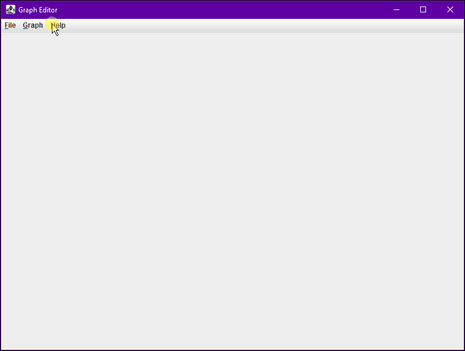
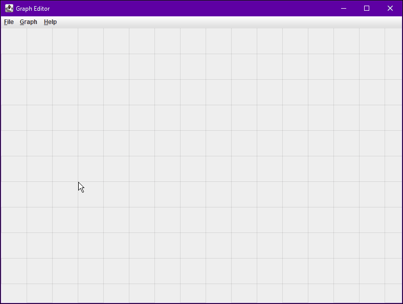
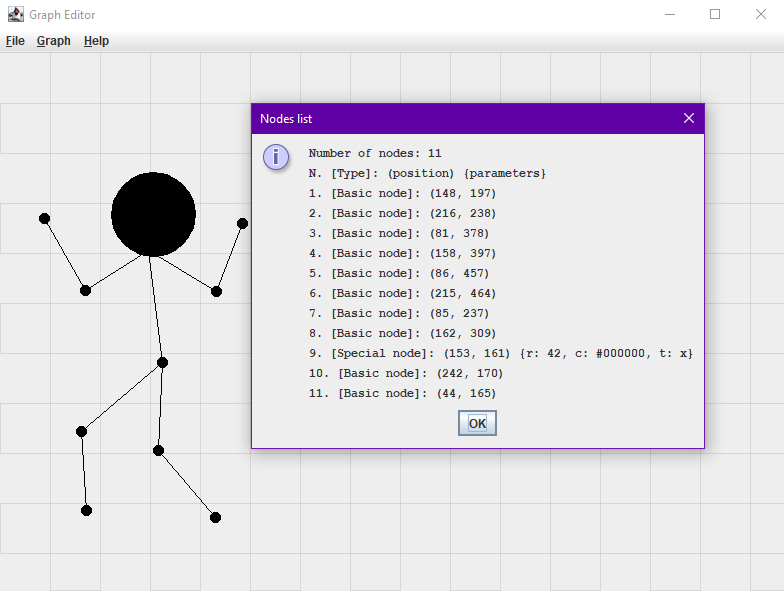
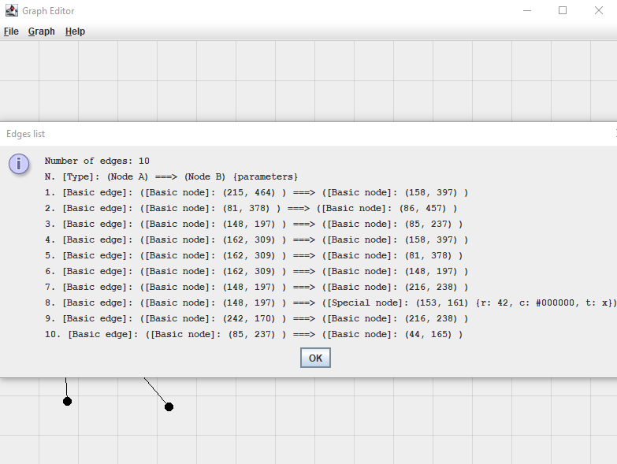

# Graph Editor
> Simple graph editor made in Java Swing.

## Table of contents
- [Graph Editor](#graph-editor)
  - [Table of contents](#table-of-contents)
  - [General info](#general-info)
  - [Screenshots](#screenshots)
  - [Technologies](#technologies)
  - [Setup and run](#setup-and-run)
  - [Features](#features)
  - [Issues](#issues)
  - [Status](#status)
  - [Contact](#contact)

## General info
This program was created as an assigment for Java 1.8 course. Its main goal was to learn how to use many different Swing controls, how to define own controls and how to handle mouse and keyboard input. It was also a training in executing file read/write operations, exceptions handling and generally writing in Object Oriented Programming paradigm.

## Screenshots






## Technologies
* Java 1.8 with Swing library.

## Setup and run
In order to run this project, Java 1.8 is required. Simply download this repository, add it to your Java IDE workspace and run it as Java Application (you can also build project to standalone aplication).

## Features
List of features:
* Create your own graph in any shape.
* Save/load function.
* Autosave/autoload function.
* Add/edit/remove nodes.
* Add/edit/remove edges.
* Two types of nodes:

    | Property | Basic node | Special node    |
    | -------- | ---------- | --------------- |
    | Color    | black      | any color       |
    | Size     | one size   | different sizes |
    | Text     | no text    | any text        |

* Two types of edges:

    | Property | Basic edge | Special edge    |
    | -------- | ---------- | --------------- |
    | Color    | black      | any color       |
    | Size     | one size   | different sizes |

* Display list of nodes.
* Display list of edges.
* Enable/disable grid helper.
* Keyboard shortcuts:

```
Keyboard shortcuts:
"q" - show/hide grid helper
"z" - add node
"x" - add edge
Alt + "LETTER" - open related menu
Ctrl + "s" - save to file
Ctrl + "o" - load from file
When cursor is over special node/edge:
"r", "g", "b" - set color to red/green/blue
"+" - increase size
"-" - decrease size
```

## Issues
No major issues are known.

## Status
This project is finished and no longer developed.

## Contact
Created by [@michaltkacz](https://github.com/michaltkacz) - feel free to contact me!
